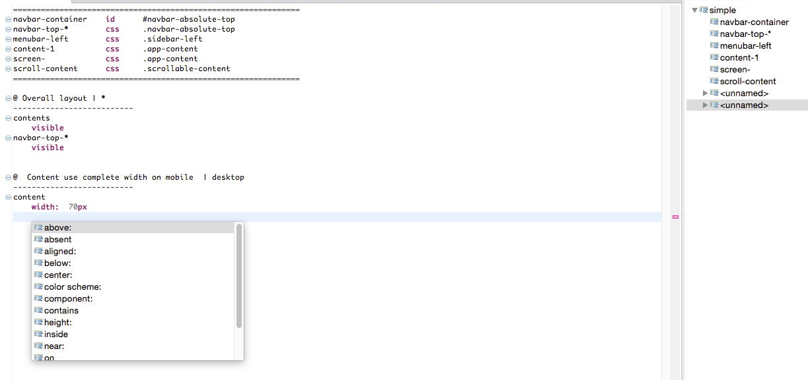

Editor for Galen Layout Specification Language
============

Currently pre-alpha only. Only support for some basic [Galen](http://galenframework.com) Spec DSL elements:

Feel free to donate

<a target="_blank" href="https://www.paypal.com/cgi-bin/webscr?cmd=_s-xclick&hosted_button_id=PACSWWSUMFATA">

</img></a>

 
